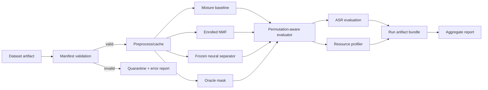

# PRD: SepID — Single-Channel Speech Separation for Indonesian Group Discussions

| | |
|---|---|
| **Status** | Reviewed draft v1.0 — implementation-ready after Phase 0 decisions |
| **Date** | 2026-09-17 |
| **Course** | Pemrosesan Sinyal Digital (Digital Signal Processing), Semester 5 |
| **Institution** | Universitas Pradita — Informatika/Sistem Informasi |
| **Lecturer** | Dr. Theresia Herlina Rochadiani |
| **Team size** | 3–4 |
| **Primary outcome** | Reproducible course final project |
| **Secondary outcome** | Evidence package suitable for conversion into an academic paper |
| **Execution environment** | Python project developed with coding-agent assistance and human approval at phase gates |

> **Document status note.** The original draft was not visibly cut off; it ended cleanly at its references section. This version completes the missing research protocol, data contract, acceptance criteria, ethics controls, statistical plan, failure handling, and Definition of Done. Assertions in this PRD are requirements or hypotheses, not research results.

## How to use this document

This PRD is the durable source of truth for both the human team and coding agents. A task is complete only when its acceptance criteria and phase exit gate pass. Agents may propose changes, but must not silently change the research questions, test split, primary metrics, model checkpoint, or exclusion rules after Phase 0. Any such change requires a dated decision-log entry and team approval.

The words **MUST**, **SHOULD**, and **MAY** indicate required, recommended, and optional scope. Sections 1–8 define product and research intent; §§9–15 define the implementation and experiment contract; §§16–24 define delivery, governance, and handoff.

---

## 1. Capability statement

SepID enables a student research team to ingest a two-speaker, single-channel mixture; run reproducible classical and pretrained-neural separation baselines; produce two estimated source tracks; and evaluate signal quality, downstream Indonesian transcription, and computational cost against controlled ground truth. The same interfaces operate on MiniLibriMix and on a consented Indonesian evaluation set, so cross-domain performance can be measured without dataset-specific evaluation code.

The project does **not** promise production-grade meeting transcription or state-of-the-art separation. Its core output is a defensible experiment and reproducible evidence package.

## 2. Executive summary

Overlapping speech is common in classroom discussions, study groups, and meetings, and it makes both automatic transcription and human review more difficult. Most widely used speech-separation benchmarks consist of clean or synthetically mixed English speech. Indonesian ASR research has separately reported poor results for a test condition containing overlapping multi-speaker speech, which motivates measuring whether separation helps under Indonesian conditions.

SepID will first prove its data, separation, evaluation, and reporting pipeline on MiniLibriMix. It will then evaluate the frozen pipeline on a controlled Indonesian dataset with exact clean references. An optional naturalistic set may be used to test external validity, but it will not be used for full-reference signal metrics unless trustworthy isolated references exist.

The minimum viable study compares:

1. the unprocessed mixture;
2. a classical, speaker-enrolled semi-supervised NMF separator;
3. one frozen pretrained neural separator;
4. an oracle time-frequency mask as a non-deployable upper-bound control.

The primary outcome is scale-invariant signal-to-distortion ratio improvement (SI-SDRi). Secondary outcomes are SDR, optional intelligibility metrics, multi-speaker ASR error, and resource cost. Null or negative findings remain valid if the protocol is followed and reported honestly.

## 3. Background and evidence

### 3.1 Problem

A single microphone records an additive mixture rather than independently observable sources. When speakers overlap, a transcription model must infer words from competing voices, and a separator must solve an underdetermined source-recovery problem. Performance established on English read speech may not transfer to Indonesian, spontaneous delivery, code-switching, different microphones, or room acoustics.

### 3.2 Verified motivation

- MiniLibriMix is an official small LibriMix derivative with 800 training mixtures, 200 validation mixtures, clean two-speaker mixtures, noisy mixtures, and source references.
- The 2024 IDSV study includes Indonesian spontaneous speech and reports unsatisfactory ASR results for a condition affected by overlapping multi-speaker utterances.
- Asteroid exposes pretrained separation models through Hugging Face, but model identity, sample rate, training data, and license vary by checkpoint and therefore must be frozen before evaluation.

### 3.3 Evidence boundaries

This PRD does **not** assert that no Indonesian overlapping-speech data or prior separation study exists. Before a paper submission, the team MUST run and document a structured literature search in at least IEEE Xplore, Google Scholar, arXiv, and an Indonesian index such as GARUDA/SINTA. The wording “first” may appear in a paper only if that review supports it; otherwise use “to our knowledge” with the search date and scope, or remove the priority claim.

The course rubric cited in the original draft was not provided during this review. Its exact requirements MUST be checked against the lecturer’s current guide during Phase 0.

## 4. Users, stakeholders, and surfaces

| Actor | Need | Surface |
|---|---|---|
| Student research team | Repeatable experiments, traceable artifacts, manageable scope | CLI, configs, notebooks, results directory |
| Course examiner | Evidence that DSP requirements and evaluation criteria are met | Report, demo, plots, reproducibility instructions |
| Dataset participant | Informed, limited, revocable use of their recording | Consent form and participant information sheet |
| Future researcher | Understandable methods and, only when authorized, reusable data/code | Repository, dataset card, model card, release archive |
| Paper reviewer | Valid novelty framing, no leakage, appropriate statistics, honest limitations | Paper and supplementary evidence |

The primary product surface is a CLI. A Streamlit interface is optional and MUST call the same library functions rather than duplicate the pipeline.

## 5. Goals, non-goals, and success criteria

### 5.1 Goals

**Course goals**

- Demonstrate time-domain and frequency-domain analysis.
- Implement at least two substantive DSP operations and compare before/after results.
- Use at least two evaluation metrics.
- Deliver runnable code/notebooks, a report, and a live or recorded demonstration.

**Research goals**

- Quantify how a frozen English-benchmark-trained separator transfers to controlled Indonesian two-speaker mixtures.
- Determine whether separation changes Indonesian multi-speaker transcription error.
- Compare separation quality with compute, memory, and assumption costs.
- Release code and an evidence package; release audio only if every participant and the institution permit it.

**Product goals**

- One dataset-independent pipeline from manifest to separated audio and metrics.
- Deterministic experiment runs with immutable configurations and machine-readable outputs.
- A CLI that provides useful validation errors and never presents metrics as available when references are absent.

### 5.2 Non-goals

- More than two simultaneous speakers in v1.
- Real-time or streaming inference.
- Training a large separator from scratch.
- Speaker diarization, speaker identification, or production meeting-note generation.
- Claims that separation improves every ASR model or every real-world recording condition.
- Using an oracle mask as a deployable method.
- Treating digitally mixed separate recordings as natural simultaneous conversation.
- Publishing identifiable audio without explicit release permission.

### 5.3 Success criteria

| Dimension | Required success condition |
|---|---|
| Course | Every verified rubric item is mapped to an artifact and demonstrated |
| Pipeline | A clean environment can reproduce one MiniLibriMix and one Indonesian controlled evaluation run from documented commands |
| Correctness | Synthetic identity tests, permutation tests, mixture-consistency tests, and metric sanity checks pass |
| Research | All preregistered primary conditions run on the frozen test manifests; no result direction is required |
| Reproducibility | Each table row links to a run ID, config hash, code revision, model ID, and manifest checksum |
| Demo | A valid mixture produces two output files and a run summary; invalid input produces a clear error |
| Publication readiness | Literature review, release rights, full experiment, limitations, and co-author review are complete |

## 6. Research questions, hypotheses, and outcome hierarchy

### 6.1 Research questions

- **RQ1 — Generalization:** How much does frozen neural separation performance change from MiniLibriMix to controlled Indonesian conversational-style mixtures?
- **RQ2 — Downstream impact:** Does separation reduce multi-speaker Indonesian ASR error relative to the unprocessed mixture under the selected evaluation protocol?
- **RQ3 — Practical trade-off:** How do the enrolled NMF and neural methods differ in SI-SDRi, ASR error, real-time factor, peak memory, model size, and setup assumptions?
- **RQ4 — Condition sensitivity:** How do overlap ratio, source-to-source level ratio, code-switch presence, speaker gender grouping where consented, and recording condition relate to performance?

### 6.2 Hypotheses

- **H1:** The frozen neural separator’s median SI-SDRi is lower on the Indonesian controlled test set than on a matched MiniLibriMix condition.
- **H2:** At least one separator lowers the chosen multi-speaker ASR error relative to the mixture baseline on the Indonesian controlled test set.
- **H3:** The neural method provides higher median SI-SDRi than the enrolled NMF baseline, while the NMF baseline has a lower resource footprint.

These hypotheses MUST be frozen before the final test run. A failed hypothesis is a result, not a reason to change the test set or metric.

### 6.3 Outcome hierarchy

- **Primary:** per-mixture SI-SDR improvement, computed after best-permutation source assignment.
- **Secondary:** SDR improvement; multi-speaker ASR error; real-time factor; peak resident/GPU memory; model/package size.
- **Exploratory:** SIR/SAR, STOI, condition-specific subgroup results, naturalistic-set behavior, and light fine-tuning.

Only the primary outcome supports the main confirmatory claim. Secondary and exploratory findings MUST be labeled accordingly.

## 7. Contribution and novelty framing

The intended contribution stack is:

1. a reproducible cross-domain evaluation of frozen separation methods on controlled Indonesian conversational-style mixtures;
2. a consented, documented evaluation protocol and manifest format, with conditional release of audio;
3. permutation-aware downstream ASR analysis rather than signal metrics alone;
4. a practical comparison that reports both quality and deployment cost.

Safe draft contribution statement:

> “We evaluate classical and pretrained neural single-channel speech separation under controlled Indonesian conversational-style conditions, quantify cross-domain performance relative to an English benchmark, examine downstream multi-speaker ASR error, and report reproducible quality–cost trade-offs.”

The following stronger phrases are prohibited until supported by the final literature review and actual artifacts: “the first,” “fills the dataset gap,” “natural discussion dataset” for digitally mixed audio, and “improves transcription” before a statistically supported result exists.

## 8. Scope and method definitions

### 8.1 Required experiment conditions

| ID | Method | Information available at inference | Role |
|---|---|---|---|
| M0 | Unprocessed mixture | Mixture only | Lower baseline |
| M1 | Semi-supervised NMF with speaker enrollment | Mixture plus clean enrollment speech for the two known speakers | Classical DSP baseline with disclosed extra assumption |
| M2 | Frozen pretrained neural separator | Mixture only | Main zero-shot separator |
| M3 | Ideal ratio or ideal binary mask | Mixture plus clean references | Non-deployable analysis upper bound |
| M4 | Fine-tuned neural separator | Mixture; trained on Indonesian development data | Stretch only, never required for course completion |

### 8.2 Classical baseline contract

Plain unconstrained NMF is not accepted as evidence that two unknown speakers were separated. M1 MUST:

- learn separate non-negative dictionaries from clean enrollment utterances for each test speaker;
- keep enrollment utterances disjoint from mixture source utterances;
- use a frozen STFT, rank, divergence/loss, iteration count, initialization rule, mask rule, and reconstruction method;
- include an optional residual/noise dictionary only if defined before the test run;
- disclose that it is speaker-dependent and therefore not assumption-equivalent to M2.

If the team cannot collect enrollment speech, M1 becomes an exploratory NMF decomposition and MUST not be described as an equivalent separator baseline.

### 8.3 Neural baseline contract

M2 MUST use exactly one frozen checkpoint for the main study. Before evaluation, record:

- exact model identifier and immutable revision/commit where supported;
- framework and dependency versions;
- expected sample rate and number of sources;
- training dataset and task;
- license and any commercial/non-commercial restrictions;
- chunking/overlap-add behavior for long audio;
- normalization and resampling behavior.

The current preference is a two-speaker ConvTasNet-family checkpoint available through Asteroid/Hugging Face. If dependency compatibility or licensing blocks it, the team may choose another established two-speaker checkpoint during Phase 0, then freeze it. Switching after test inspection invalidates direct comparison unless all conditions are rerun and the change is documented.

### 8.4 DSP techniques for course evidence

The report will explicitly demonstrate, at minimum:

1. resampling/filtering and STFT analysis/synthesis with windowing and overlap-add; and
2. NMF plus time-frequency masking and inverse STFT reconstruction.

Pre-emphasis and VAD may be included, but MUST not be the sole justification for a substantive separation technique.

## 9. Data plan and governance

### 9.1 Dataset layers

| Layer | Purpose | Ground truth | Required? |
|---|---|---|---|
| D1 MiniLibriMix | Pipeline validation and English benchmark | Exact `s1`/`s2` references | Yes |
| D2 Indonesian controlled | Primary Indonesian evaluation | Exact isolated source recordings before digital mixing | Yes |
| D3 Indonesian naturalistic | External-validity demonstration | Usually imperfect because close microphones contain bleed | Optional |
| D4 Reduced LibriMix | Additional training/development scale | Exact references | Optional |

### 9.2 D1 — MiniLibriMix

- Use the official Zenodo v1.0 artifact (DOI `10.5281/zenodo.3871592`).
- Record the archive checksum and generated manifest checksum.
- Use `mix_clean` for the main clean-separation validation. `mix_both` is a separate noisy condition and MUST not be pooled silently.
- Do not tune on samples later reported as validation/test results. Because MiniLibriMix is a demonstration dataset with train and validation sets, the team MUST designate and freeze its evaluation partition in Phase 0.

### 9.3 D2 — Indonesian controlled full-reference set

The primary Indonesian experiment uses separately recorded, conversational-style utterances that are digitally mixed. This provides exact clean references but simulates overlap.

**Recommended target, subject to Phase 0 feasibility approval:**

- 8–12 consenting speakers;
- at least 200 two-speaker mixtures and 60 minutes of mixture audio after quality control;
- at least 20 mixtures for a separate pilot that will never enter the final test set;
- 16 kHz, mono, lossless WAV for released/evaluation copies; retain higher-quality masters if available;
- a balanced design across overlap ratio and source-to-source level ratio where feasible.

**Prompting and recording:**

- Prefer spontaneous or lightly prompted answers and campus-discussion topics over read sentences.
- Record one active speaker at a time in the controlled protocol to obtain isolated references.
- Capture verbatim transcripts, language/code-switch labels, microphone/device, room, and session metadata.
- Avoid sensitive personal content; participants may skip any prompt.

**Digital mixture factors:**

- overlap-ratio bins: approximately 25%, 50%, 75%, and near-total overlap;
- source-to-source level ratios: −5, 0, and +5 dB;
- randomized start offsets with a recorded seed;
- peak protection without per-output loudness manipulation after mixing;
- clipping check on every mixture;
- exact source gains and offsets stored in the manifest.

The final distribution across factor cells MUST be frozen after the pilot. Empty or underfilled cells are reported, not silently rebalanced after viewing test performance.

After the pilot, use its variance and speaker/session clustering to simulate the 95% confidence-interval width or minimum detectable paired effect for the proposed test size. Adjust the target before final recording if necessary; do not use final-test outcomes for this calculation.

### 9.4 D3 — Indonesian naturalistic external-validity set

If schedule and equipment allow, record 2–4 short group-discussion sessions using a room microphone and close-talk microphones. This set is labeled naturalistic, not full-reference, unless leakage analysis demonstrates that isolated references are sufficiently clean.

- Use it for qualitative listening, ASR behavior, failure analysis, and demo examples.
- Do not compute or pool full-reference SI-SDR/SDR using contaminated close-mic tracks as if they were clean truth.
- If a real mixture is used in the public demo, obtain explicit public-release consent from every audible participant.

### 9.5 Split and leakage rules

- Final manifests are immutable and versioned.
- All fine-tuning splits are speaker-disjoint.
- Enrollment utterances for M1 may come from the same speaker identity, because that is the method’s disclosed assumption, but MUST be recording- and utterance-disjoint from evaluation mixtures.
- Prompt text duplicates and near-duplicate audio are detected and documented.
- No final test audio is used to choose hyperparameters, model checkpoints, ASR normalization, or exclusion thresholds.
- Pilot failures inform the frozen protocol; final-test failures are reported under predefined exclusion rules.

### 9.6 Consent, privacy, and release policy

Participation consent and public-release consent are separate choices. The consent materials MUST state:

- purpose, procedures, recording types, expected use, and who can access raw data;
- that participation is voluntary and course standing is unaffected;
- whether voice is identifiable and what anonymization can and cannot do;
- separate options for project-only use, paper analysis, classroom demo, and public release;
- a withdrawal deadline before the dataset is irreversibly aggregated or released;
- contact and deletion procedure.

Raw audio and signed consent forms MUST be stored separately. Consent forms MUST never be committed to the code repository. Public speaker IDs are pseudonymous. Device paths, student IDs, phone numbers, names, and unrelated conversation are excluded from metadata.

Dataset release is conditional on institutional/lecturer guidance and every relevant permission. If public release is not allowed, the team will release code, schemas, mixing recipes, aggregate statistics, and a dataset card without the audio.

### 9.7 Retention and access

- Define an owner for the encrypted/raw-data location.
- Restrict raw-data access to approved team members.
- Record a retention/deletion date before recording begins.
- Maintain a removal ledger keyed by internal participant ID.
- Generated public artifacts MUST be checked for embedded metadata and accidental identifiers.

## 10. System architecture and lifecycle



### 10.1 Lifecycle states

`discovered → validated → preprocessed → separated → evaluated → reported`

Any stage may transition to `failed` with a typed reason. Invalid samples transition to `quarantined`; they are not deleted. A resumed run reads completed artifact metadata and continues only if config, code, model, and input hashes match.

### 10.2 Invariants

- The source mixture and references used for a run are never modified in place.
- Audio sample rate, channel count, length policy, and amplitude policy are explicit at every interface.
- Estimated sources have a leading source dimension of exactly two.
- Full-reference metrics are unavailable, not zero, when references are absent.
- Metric assignment is permutation-invariant and the chosen permutation is stored.
- Every aggregate value is reproducible from per-item records.
- Reports distinguish clean, noisy, controlled-synthetic, and naturalistic conditions.
- Test artifacts are append-only by run ID; reruns do not overwrite earlier evidence.

## 11. Interfaces and data contracts

### 11.1 Manifest schema

One row represents one mixture. Required fields:

| Field | Type | Meaning |
|---|---|---|
| `mixture_id` | string | Globally unique stable ID |
| `dataset` / `split` | enum/string | Dataset identity and frozen partition |
| `mix_path` | path | Mixture WAV |
| `source_1_path`, `source_2_path` | nullable path | Clean references; null only for no-reference data |
| `sample_rate_hz` | integer | Declared sample rate |
| `num_samples` | integer | Expected aligned length |
| `speaker_1_id`, `speaker_2_id` | pseudonymous string | Speaker identities when permitted |
| `transcript_1`, `transcript_2` | nullable string/path | Source-level references |
| `language_tags` | list/string | Indonesian/English/code-switch annotation |
| `source_level_ratio_db` | number | Applied relative level |
| `overlap_ratio` | number in [0,1] | Fraction of active speech overlap under the frozen VAD definition |
| `offset_1_samples`, `offset_2_samples` | integer | Mixing offsets |
| `session_id` | string | Cluster identifier for analysis |
| `consent_scope` | enum | Internal analysis/demo/public eligibility, without personal details |
| `sha256_*` | string | Integrity hashes for source and mixture files |

Schema validation fails on duplicate IDs, missing files, unsupported encoding, inconsistent lengths, clipping beyond policy, invalid consent scope, or split leakage.

### 11.2 Separator interface

Conceptual Python contract:

```python
class Separator(Protocol):
    name: str
    sample_rate_hz: int
    num_sources: int = 2

    def separate(self, mixture: FloatTensor) -> FloatTensor:
        """Return shape [2, time], without changing input in place."""
```

Adapters own resampling to and from a model’s native rate. Length restoration and padding removal are deterministic. The adapter records processing time, device, chunking, and warnings.

### 11.3 Run configuration

Each run config MUST include dataset manifest/version, method, checkpoint revision, seed, preprocessing parameters, metric versions, ASR model/revision, hardware tag, output path, and whether the run is pilot or final.

### 11.4 Run artifact bundle

```
results/<run_id>/
├── config.resolved.yaml
├── provenance.json
├── validation_report.json
├── per_item_metrics.parquet
├── aggregate_metrics.json
├── resource_metrics.json
├── logs/
├── audio/                  # optional, policy-controlled
├── figures/
└── run_summary.md
```

`provenance.json` contains code revision or source snapshot hash, dependency lock hash, OS/Python/PyTorch versions, model revision, manifest checksum, start/end time, and completion status.

## 12. Functional requirements and acceptance criteria

| ID | Requirement | Priority | Acceptance criteria |
|---|---|---|---|
| FR-1 | Unified manifest loader | Must | Loads D1 and D2 through the same API; schema errors name the row and field; leakage validator has automated tests |
| FR-2 | Preprocessing | Must | Deterministic resampling, mono policy, amplitude/clipping checks, optional VAD, and exact length accounting; identity configuration round-trips within tolerance |
| FR-3 | Visualization | Must | Produces aligned waveforms, magnitude spectrograms, and before/after panels with units, sample rate, color scale, and run ID |
| FR-4 | Enrolled NMF separator | Must | Uses frozen speaker dictionaries, emits two aligned tracks, records hyperparameters, and passes synthetic source-recovery smoke tests |
| FR-5 | Neural separator adapter | Must | Loads frozen model revision, validates sample rate/source count, supports CPU, restores input duration, and passes deterministic smoke test within documented tolerance |
| FR-6 | Oracle mask control | Must | Uses references only in oracle mode, is impossible to invoke in demo mode, and is labeled non-deployable in every report |
| FR-7 | Signal evaluation | Must | Computes permutation-aware SI-SDR/SI-SDRi and SDR/SDRi per item; sanity tests cover identity, swapped outputs, silence, and corrupted length |
| FR-8 | ASR evaluation | Should | Uses frozen normalization and a multi-speaker/permutation-aware scoring protocol; stores raw hypotheses; test items never tune normalization |
| FR-9 | Cross-domain analysis | Must | Runs the same frozen M2 adapter and primary metric on D1 and D2; reports condition/sample differences and uncertainty |
| FR-10 | Resource profiling | Must | Reports wall-clock real-time factor, peak RAM, optional peak VRAM, model size, hardware, and warm-up policy |
| FR-11 | Reporting | Must | Generates tables/figures from machine-readable per-item results; every aggregate traces to a run ID and sample count |
| FR-12 | CLI demo | Must | Given a valid WAV, creates two outputs and a summary; with references, adds metrics; without references, clearly marks metrics unavailable |
| FR-13 | Recording/mixing toolkit | Must | Generates IDs/manifests, performs clipping/integrity checks, records gains/offsets/seeds, and never bundles consent forms |
| FR-14 | Naturalistic data mode | Could | Accepts reference-free audio and disables full-reference metrics automatically |
| FR-15 | Fine-tuning | Could | Uses speaker-disjoint train/dev/test, saves training provenance, and is reported separately from zero-shot M2 |

## 13. Non-functional requirements

### 13.1 Reproducibility

- Use a lockfile or fully pinned environment export in addition to a human-readable dependency file.
- Seed Python, NumPy, and PyTorch where applicable; document nondeterministic kernels.
- Store configs and manifests under version control, but not restricted audio.
- Provide one command for a small smoke run and one command for each final experiment.

### 13.2 Portability and performance

- M1 and the smoke-test path MUST run without a GPU.
- M2 MUST support CPU inference even if slower; GPU acceleration is optional.
- Long-file processing MUST have a documented memory-safe chunking strategy.
- No fixed real-time target is required, but measured real-time factor and memory are mandatory.

### 13.3 Reliability and recovery

- Atomic writes for metric/result files.
- Failed items do not erase successful items and are summarized with typed reasons.
- Resume is allowed only on matching provenance hashes.
- Partial final runs are labeled incomplete and excluded from confirmatory aggregate tables unless the predefined failure rule allows inclusion.

### 13.4 Security and privacy

- No secrets, participant identifiers, signed forms, or restricted audio in Git.
- Logs MUST not print private filesystem metadata or participant names.
- Public exports run a metadata/privacy checklist.

### 13.5 Maintainability

- Typed interfaces at dataset, separator, evaluator, and reporter boundaries.
- Unit tests for numerical utilities and contract tests for every separator adapter.
- Notebooks call library code and do not contain the only implementation of an experiment.
- Documentation explains scientific assumptions, not just commands.

## 14. Evaluation and statistical analysis plan

### 14.1 Signal evaluation

For each mixture and method:

1. align output length under the frozen policy;
2. evaluate both source permutations;
3. select the permutation maximizing mean SI-SDR;
4. use the same stored assignment for linked per-source analyses unless the analysis protocol explicitly requires its own assignment;
5. compute input SI-SDR against each reference and report improvement (`output − input`);
6. store per-source and per-mixture values, failures, and permutation.

Silence/near-silence behavior and epsilon policy MUST be tested and documented. SIR/SAR are exploratory because definitions and implementations vary. Metric package and version are part of provenance.

### 14.2 ASR evaluation

Ordinary WER against one arbitrarily chosen source is prohibited for overlapping mixtures. During the pilot, the team MUST choose and freeze a single primary multi-speaker scoring procedure, preferably using a maintained implementation such as `meeteval`:

- a meeting-aware metric such as ORC-WER for mixture and separated conditions; or
- a clearly specified concatenated/permutation WER protocol when two hypothesis streams exist.

The selected procedure MUST define transcript normalization for casing, punctuation, numerals, filled pauses, Indonesian affixes, English code-switches, and unintelligible tokens. Report WER and, if useful for Indonesian morphology/spelling, CER as a secondary metric. Store unnormalized and normalized references/hypotheses.

Because the unprocessed mixture may yield one hypothesis stream while separation yields two, the metric’s treatment of different stream counts MUST be validated on toy examples before Phase 3. If a fair comparable protocol cannot be validated in time, ASR evaluation becomes exploratory and the course project remains complete using signal metrics.

### 14.3 Resource evaluation

- Run one warm-up and at least three measured repetitions per representative file set.
- Report audio duration, batch size, device, thread count, and chunk settings.
- Compute real-time factor as processing seconds divided by input-audio seconds.
- Separate model-download/setup time from inference time.

### 14.4 Statistical units and tests

- The basic observation is a mixture, but confidence intervals SHOULD cluster by speaker pair or session to reduce pseudo-replication.
- Method comparisons on the same mixtures are paired. Use a 95% paired cluster-bootstrap confidence interval and either a paired permutation test or Wilcoxon signed-rank test if its assumptions are acceptable.
- Cross-dataset D1–D2 comparisons are not inherently paired. Prefer a regression or stratified comparison controlling for overlap ratio, level ratio, and duration; otherwise report an unpaired bootstrap/Mann–Whitney analysis with the limitation stated.
- Report effect sizes and confidence intervals, not only p-values.
- Correct for multiple comparisons when making confirmatory claims across several secondary outcomes/subgroups.
- Exclusion reasons and missingness are tabulated by method and dataset.

The team MUST freeze the exact analysis notebook/script before revealing final-test aggregates.

### 14.5 Core experiment matrix

| Method | D1 MiniLibriMix | D2 Indonesian controlled | D3 naturalistic | Role |
|---|---:|---:|---:|---|
| M0 mixture | Yes | Yes | Yes | Baseline/ASR input |
| M1 enrolled NMF | Optional if compatible enrollment can be defined | Yes | Optional | Classical baseline |
| M2 frozen neural | Yes | Yes | Yes | Core generalization result |
| M3 oracle mask | Yes | Yes | No | Upper bound |
| M4 fine-tuned neural | No | Stretch | Stretch | Adaptation study |

M1 is not used for a direct cross-dataset generalization claim unless the enrollment protocol is equivalent across datasets.

## 15. Demo behavior

Minimum command shape:

```text
sepid separate INPUT.wav --method neural --output-dir RUN_DIR
sepid evaluate MANIFEST.csv --methods mixture,nmf,neural,oracle --config CONFIG.yaml
sepid report RUN_ID
```

For an ad hoc file without references, the demo returns separated tracks, waveform/spectrogram plots, processing time, and warnings. It MUST not fabricate SI-SDR/SDR. With a valid manifest and references, it may show metrics. The UI displays method assumptions, including “speaker enrollment required” for NMF and “oracle—not deployable” for M3.

Audio outputs SHOULD be peak-normalized only for playback copies; metric computation uses the unmodified numerical outputs. The report makes this distinction explicit.

## 16. Repository structure

```text
sepid/
├── README.md
├── LICENSE
├── pyproject.toml
├── lockfile-or-environment-lock
├── configs/
│   ├── datasets/
│   ├── methods/
│   └── experiments/
├── manifests/                 # metadata only; frozen versions
├── src/sepid/
│   ├── cli.py
│   ├── data/
│   │   ├── schema.py
│   │   ├── loader.py
│   │   ├── validation.py
│   │   └── mixing.py
│   ├── audio/
│   │   ├── preprocessing.py
│   │   └── visualization.py
│   ├── separators/
│   │   ├── base.py
│   │   ├── mixture.py
│   │   ├── nmf_enrolled.py
│   │   ├── neural.py
│   │   └── oracle_mask.py
│   ├── evaluation/
│   │   ├── assignment.py
│   │   ├── signal.py
│   │   ├── asr.py
│   │   ├── resources.py
│   │   └── statistics.py
│   ├── reporting/
│   └── provenance.py
├── scripts/
│   ├── acquire_minilibrimix.*
│   ├── build_indonesian_manifest.*
│   └── release_privacy_check.*
├── notebooks/                # analysis/teaching views; import src/sepid
├── tests/
│   ├── unit/
│   ├── contract/
│   ├── fixtures/             # tiny generated, non-participant audio
│   └── integration/
├── docs/
│   ├── DECISIONS.md
│   ├── DATASET_CARD.md
│   ├── MODEL_CARD.md
│   ├── ETHICS_AND_CONSENT.md
│   ├── EXPERIMENT_PROTOCOL.md
│   └── RUBRIC_TRACEABILITY.md
└── results/                  # generated; large/private artifacts gitignored
```

## 17. Milestones, phase gates, and schedule

Dates are intentionally relative because the course calendar was not provided. The team should map these stages to actual deadlines in Phase 0.

### Phase 0 — Decisions and preregistration

**Tasks**

- Verify the current course guide and create `RUBRIC_TRACEABILITY.md`.
- Freeze primary RQs, outcome, model checkpoint, MiniLibriMix evaluation partition, D2 target, exclusion rules, and ASR pilot decision.
- Audit licenses for dataset, model, ASR, and code.
- Approve consent materials and data-retention plan before recording.
- Record hardware, storage, and time budget.

**Exit gate**

- All blocking decisions in §22 have owners and resolutions.
- `EXPERIMENT_PROTOCOL.md`, consent documents, and decision log are approved by the team.
- No participant recording has started before this gate.

### Phase 1 — Scaffold and correctness fixtures

**Tasks**

- Create the package structure, environment lock, CLI skeleton, generated toy fixtures, manifest schema, and provenance bundle.
- Implement preprocessing, plots, M0, M3, source assignment, primary metrics, and core tests.

**Exit gate**

- Clean installation succeeds on at least one team laptop.
- Identity, source-swap, oracle, silence/error, and mixture-consistency tests pass.
- A generated two-source toy example completes end-to-end.

### Phase 2 — MiniLibriMix pipeline

**Tasks**

- Acquire and checksum D1.
- Implement M2 and validate sample-rate/length handling.
- Run a smoke subset, then the frozen D1 evaluation partition.
- Implement reporting and resource profiling.

**Exit gate**

- No unexplained NaN/Inf values.
- Every processed item has provenance and a per-item result or typed failure.
- A human listens to a predefined sample set and verifies channel/content plausibility.
- Results are within a plausible range relative to the selected model card or the discrepancy is explained; they need not reproduce a paper exactly.

### Phase 3 — Indonesian pilot and protocol freeze

**Tasks**

- Obtain consent and record a pilot only.
- Implement the recording/mixing toolkit and M1 enrollment path.
- Test transcript normalization and candidate ASR metric on toy and pilot examples.
- Run leakage, clipping, alignment, and privacy checks.

**Exit gate**

- The pilot is excluded from final test data.
- Final D2 factors, split, sample target, failure/exclusion rules, and ASR decision are frozen.
- At least two team members review random mixtures, references, transcripts, and metadata.

### Phase 4 — Final Indonesian data and locked evaluation

**Tasks**

- Record/prepare D2 under the frozen protocol.
- Generate immutable manifests and checksums.
- Run M0–M3 with no final-test tuning.
- Execute frozen analysis and create tables/figures.

**Exit gate**

- Target coverage or documented shortfall is reported.
- All exclusions follow predefined rules.
- Confirmatory aggregates are generated from a complete run or explicitly labeled incomplete.
- A second team member independently checks at least one aggregate against per-item data.

### Phase 5 — Demo, report, and release

**Tasks**

- Finalize CLI and optional UI.
- Prepare report, demo, dataset/model cards, limitations, and reproducibility instructions.
- Run the privacy/license/release checklist.
- Perform a fresh-environment reproduction on a small public/non-sensitive subset.

**Exit gate**

- Course Definition of Done in §21 passes.
- Public release contains only approved artifacts.
- Claims match results and uncertainty; contribution wording passes the novelty gate.

### Phase 6 — Optional paper/fine-tuning

Begins only after Phase 5. Any M4 fine-tuning uses untouched, speaker-disjoint test data and is reported as a separate experiment rather than replacing an unfavorable zero-shot result.

## 18. Team roles and review responsibilities

| Role | Owns | Required reviewer |
|---|---|---|
| Data and ethics lead | Consent, recordings, metadata, access, release checklist | Team lead/lecturer as appropriate |
| DSP and pipeline lead | Preprocessing, NMF, oracle mask, visualization | ML/evaluation lead |
| ML and evaluation lead | Neural adapter, metrics, ASR, statistics | DSP lead |
| Reproducibility/writing/demo lead | Provenance, reporting, README, demo, paper | At least one technical lead |

With three people, reproducibility/writing is shared. No person approves their own high-risk artifact alone: consent/release, test-manifest freeze, primary aggregate, and paper claims require a second reviewer.

## 19. Risk register

| Risk | Likelihood/impact | Trigger | Mitigation / fallback |
|---|---|---|---|
| NMF fails to produce meaningful sources | High/medium | Pilot SI-SDRi near or below mixture and listening failure | Keep as a transparent speaker-enrolled classical baseline; do not overclaim; course evidence still includes NMF/masking implementation |
| Neural checkpoint incompatible or unavailable | Medium/high | Install/load/license gate fails | Select and freeze an alternative established checkpoint in Phase 0; do not switch after final-test inspection |
| Synthetic Indonesian data cannot support “natural” claims | Certain/high if misworded | Separate-then-mix is primary protocol | Use “controlled conversational-style mixtures”; reserve “naturalistic” for D3 |
| Insufficient speakers or mixtures | Medium/high | Phase 3 recruitment/coverage below target | Reduce factor grid before final freeze, emphasize estimation/CI, and avoid broad population claims |
| Consent does not permit open release | Medium/medium | Participants decline release or institution disallows it | Release code, schema, recipes, cards, and aggregates only |
| ASR scoring is not comparable | Medium/high | Toy/pilot validation fails | Mark ASR exploratory or drop it; finish course with signal metrics |
| Source/reference alignment error | Medium/high | Oracle or identity tests fail | Block evaluation; repair mixing/resampling/length path before proceeding |
| Dataset/model leakage | Low/high | Duplicate/speaker overlap validator fails | Rebuild split before final evaluation; log decision |
| Final runs exceed compute/storage | Medium/medium | Pilot resource profile breaches budget | Shorten/chunk files, reduce optional conditions, retain M0–M3 core |
| Null generalization or ASR result | Medium/low scientifically | H1/H2 unsupported | Report honestly with confidence intervals and failure analysis; do not tune on test |
| Agent-generated code changes protocol | Medium/high | Diff alters frozen config/schema/metric | Mandatory review of protocol-sensitive diffs and config hashes at phase gates |
| Citation/novelty claim unsupported | Medium/high for publication | Literature search finds related work | Narrow contribution wording and cite prior work |

## 20. Course compliance traceability

The following maps the requirements stated in the original draft. Phase 0 MUST correct it if the current guide differs.

| Claimed course requirement | Evidence artifact |
|---|---|
| Own or legally documented public dataset | MiniLibriMix license/source record; D2 consent/data card |
| Time-domain visualization | Aligned waveform figure generated by FR-3 |
| Frequency-domain analysis | STFT/spectrogram figure with parameters and units |
| At least two DSP techniques | STFT analysis/synthesis and NMF/masking; preprocessing filter as additional evidence |
| Before/after comparison | Mixture versus M1/M2 outputs, plots and SI-SDRi/SDRi |
| At least two metrics | SI-SDRi and SDRi; resource/ASR metrics additional |
| Runnable source/notebook | Locked environment, CLI, tests, notebooks importing package code |
| Written report and demo | Final report, run bundle, CLI/UI demonstration or video |

## 21. Definition of Done

### 21.1 Course MVP done

- Phase 0–5 required exit gates pass.
- M0–M3 run on a frozen D2 controlled test set, with any shortfall documented.
- Primary and one secondary signal metric are reported with sample counts and uncertainty.
- DSP figures, source audio examples, code, tests, README, report, and demo exist.
- A clean-machine smoke reproduction succeeds.
- Ethics, privacy, and licenses are documented.

### 21.2 Research study done

- RQ1–RQ3 are answered without changing frozen definitions after seeing test results.
- Per-item results and exclusions are auditable.
- Paired/unpaired statistical procedures match the design.
- Limitations distinguish language, domain, speaker, recording, and synthetic-overlap effects.

### 21.3 Publication-ready done

- Structured literature review and bibliography are complete.
- Novelty wording is evidence-supported.
- Dataset/model cards and artifact availability statement match actual rights.
- Paper tables reproduce from scripts.
- All authors verify claims, figures, and ethical statements.

Publication readiness is not required for course completion.

## 22. Open decisions and owners

These are explicit Phase 0 blockers, not permission to improvise during implementation.

| ID | Decision | Default recommendation | Owner / deadline |
|---|---|---|---|
| OD-1 | Exact current course rubric and deadlines | Obtain lecturer guide; update traceability and schedule | Team lead, before Phase 1 |
| OD-2 | Frozen neural checkpoint and revision | Two-speaker, CPU-capable, documented training data/license | ML lead, Phase 0 |
| OD-3 | MiniLibriMix evaluation partition | Freeze an evaluation subset; never tune on it | Evaluation lead, Phase 0 |
| OD-4 | D2 participant/sample target feasible for team | Aim for 8–12 speakers, ≥200 mixtures, ≥60 min; reduce grid before recording if needed | Data lead, Phase 0 |
| OD-5 | ASR model and multi-speaker metric | Pilot a frozen Indonesian-capable model plus ORC-WER/cpWER implementation | Evaluation lead, Phase 3 gate |
| OD-6 | Dataset/public-demo release scope | Default to private until explicit release consent and institutional approval | Ethics lead, before recording |
| OD-7 | Naturalistic D3 scope | Optional; collect only after D2 schedule is safe | Team, after Phase 3 |
| OD-8 | Hardware/storage/time budget | Measure on actual team laptop and set run budget | Pipeline lead, Phase 0 |
| OD-9 | Paper venue | Defer formatting until results exist; do not promise SINTA submission | Writing lead, Phase 5 |

## 23. Agent execution backlog

### Epic A — Governance and specification

- [ ] Create decision log and rubric traceability.
- [ ] Freeze experiment protocol, model card, dataset card skeleton, and release policy.
- [ ] Convert manifest contract into a versioned schema.

### Epic B — Core correctness

- [ ] Scaffold package, CLI, configs, lock, tests, and generated fixtures.
- [ ] Implement manifest validation, preprocessing, provenance, and lifecycle states.
- [ ] Implement M0, M3, permutation assignment, SI-SDRi, SDRi, and sanity tests.

### Epic C — Methods

- [ ] Implement M1 speaker-enrolled NMF with frozen hyperparameters and enrollment checks.
- [ ] Implement M2 neural adapter with model revision, sample-rate, length, device, and chunking controls.
- [ ] Add listening-sample export and mixture-consistency diagnostics.

### Epic D — Data

- [ ] Acquire/checksum D1 and build manifest.
- [ ] Build D2 recording, transcription, mixing, QC, and manifest tools.
- [ ] Run pilot, freeze protocol, then create final immutable manifests.
- [ ] Optionally add reference-free D3 loader.

### Epic E — Evaluation and reporting

- [ ] Add resource profiling and per-item result store.
- [ ] Validate and freeze ASR metric or downgrade it to exploratory.
- [ ] Implement cluster-aware confidence intervals and paired comparisons.
- [ ] Generate all paper/report tables from run artifacts.

### Epic F — Demo and release

- [ ] Implement CLI and optional thin Streamlit UI.
- [ ] Add privacy/license/release checks.
- [ ] Run fresh-environment reproduction and create final report/demo.

At each phase gate, the agent produces: changed files, commands run, tests/results, deviations, unresolved decisions, and the next proposed task. It MUST not fabricate recordings, consent, metric values, literature coverage, or successful runs.

## 24. References and verified resources

1. Cosentino, J., Pariente, M., Cornell, S., Deleforge, A., & Vincent, E. (2020). *LibriMix: An Open-Source Dataset for Generalizable Speech Separation.* arXiv:2005.11262. <https://arxiv.org/abs/2005.11262>
2. MiniLibriMix dataset, Zenodo v1.0, DOI 10.5281/zenodo.3871592. <https://zenodo.org/records/3871592>
3. Adila, A., Lestari, D., Purwarianti, A., Tanaya, D., Azizah, K., & Sakti, S. (2024). *Enhancing Indonesian Automatic Speech Recognition: Evaluating Multilingual Models with Diverse Speech Variabilities.* O-COCOSDA 2024 / arXiv:2410.08828. <https://arxiv.org/abs/2410.08828>
4. Pariente, M., et al. (2020). *Asteroid: the PyTorch-based audio source separation toolkit for researchers.* Interspeech 2020. Project: <https://github.com/asteroid-team/asteroid>
5. Asteroid pretrained-model documentation. <https://asteroid-team.github.io/asteroid/readmes/pretrained_models.html>
6. TorchMetrics audio and permutation-invariant evaluation documentation. <https://lightning.ai/docs/torchmetrics/stable/audio/permutation_invariant_training.html>
7. von Neumann, T., Boeddeker, C., Kinoshita, K., Delcroix, M., Haeb-Umbach, R. (2023). *MeetEval: A Toolkit for Computation of Word Error Rates for Meeting Transcription Systems.* <https://github.com/fgnt/meeteval>
8. Maciejewski, M., Sell, G., Garcia-Perera, L. P., Watanabe, S., & Khudanpur, S. (2018). *Building Corpora for Single-Channel Speech Separation Across Multiple Domains.* arXiv:1811.02641. <https://arxiv.org/abs/1811.02641>

### Reference-quality note

Repository and documentation URLs above are implementation references, not substitutes for peer-reviewed citations in the paper. The final bibliography MUST be generated from verified metadata, and every factual novelty claim MUST point to the structured literature-review record.

---

## Appendix A — Minimum phase-gate checklist

```text
[ ] Scope/config frozen and decision log updated
[ ] Inputs licensed/consented and checksummed
[ ] Automated tests pass
[ ] Human listening/visual QC completed where required
[ ] Per-item failures and exclusions reviewed
[ ] Provenance bundle complete
[ ] Claims match evidence and are not copied from hypotheses
[ ] Second reviewer signs off
```

## Appendix B — Required report tables

1. Dataset composition and consent/release scope.
2. Condition distribution by overlap ratio, source-level ratio, duration, and language tag.
3. Method assumptions, model IDs, parameters, and license.
4. SI-SDR/SI-SDRi and SDR/SDRi by dataset and method with sample count and confidence interval.
5. ASR metric, if validated, by dataset and method.
6. Real-time factor, memory, and model size by method/hardware.
7. Failures and exclusions by reason.
8. Subgroup/exploratory analyses, clearly labeled.

## Appendix C — Claim guardrails

| Evidence available | Allowed wording |
|---|---|
| Only controlled separate-then-mix data | “controlled Indonesian conversational-style mixtures” |
| D3 recorded but references contain bleed | “naturalistic evaluation/demo set,” not “ground-truth separation benchmark” |
| Directional point estimate without supported uncertainty | “observed in this sample,” not “improves” or “outperforms” |
| Statistically supported effect under frozen protocol | “improved under the evaluated conditions,” with effect and CI |
| No systematic literature search | “we evaluate,” not “first” or “previously unexplored” |
| Conditional/private data only | “dataset created for this study,” not “open dataset” |
